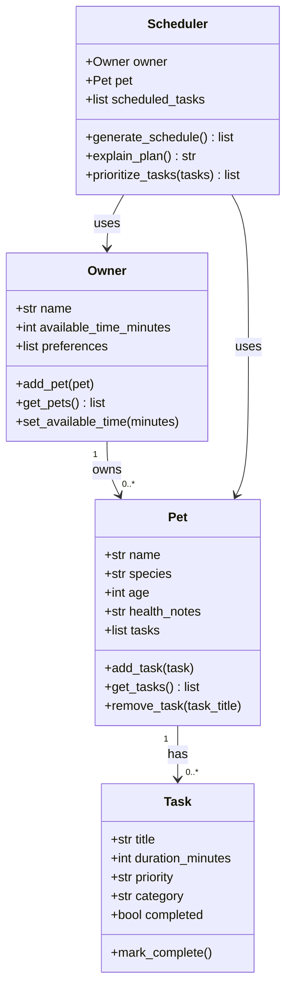

# PawPal+ Project Reflection

## 1. System Design

**Three core user actions:**

1. Add a pet by entering its name, species, age, and any health notes.
2. Add care tasks like walks, feedings, or medications, each with a time estimate and a priority level.
3. Generate a daily schedule. The user says how much free time they have and the app builds a plan and explains it.

**Mermaid.js Class Diagram:**

**a. Initial design**

I went with four classes. Owner stores the person's name, how much time they have in the day, and preferences. It holds a list of their pets.

Pet tracks the animal's basic info (name, species, age, health notes) and keeps its own list of tasks.

Task is a dataclass representing one care item. It has a title, duration in minutes, priority (low/medium/high), a category, and a flag for whether it's done. The field names line up with what app.py already uses so hooking into the UI later shouldn't need much rework.

Scheduler is where the planning happens. It takes an Owner and a Pet, looks at the available time, and decides which tasks to include and in what order. It also has a method to explain why the plan looks the way it does.

**b. Design changes**

_To be filled in after implementation or AI feedback reveals issues._

---

## 2. Scheduling Logic and Tradeoffs

**a. Constraints and priorities**

- What constraints does your scheduler consider (for example: time, priority, preferences)?
- How did you decide which constraints mattered most?

**b. Tradeoffs**

- Describe one tradeoff your scheduler makes.
- Why is that tradeoff reasonable for this scenario?

---

## 3. AI Collaboration

**a. How you used AI**

- How did you use AI tools during this project (for example: design brainstorming, debugging, refactoring)?
- What kinds of prompts or questions were most helpful?

**b. Judgment and verification**

- Describe one moment where you did not accept an AI suggestion as-is.
- How did you evaluate or verify what the AI suggested?

---

## 4. Testing and Verification

**a. What you tested**

- What behaviors did you test?
- Why were these tests important?

**b. Confidence**

- How confident are you that your scheduler works correctly?
- What edge cases would you test next if you had more time?

---

## 5. Reflection

**a. What went well**

- What part of this project are you most satisfied with?

**b. What you would improve**

- If you had another iteration, what would you improve or redesign?

**c. Key takeaway**

- What is one important thing you learned about designing systems or working with AI on this project?
