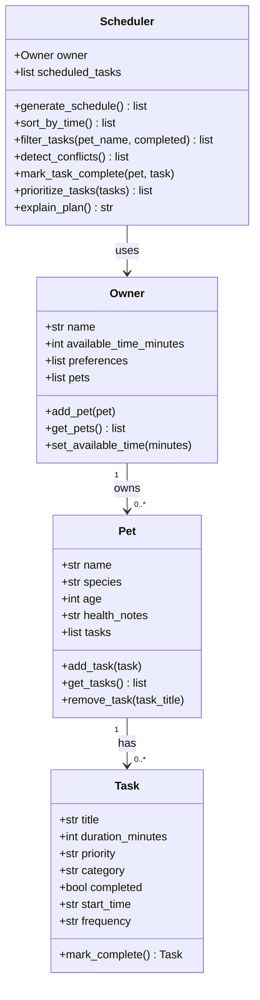

# PawPal+ Project Reflection

## 1. System Design

**Three core user actions:**

1. Add a pet by entering its name, species, age, and any health notes.
2. Add care tasks like walks, feedings, or medications, each with a time estimate and a priority level.
3. Generate a daily schedule. The user says how much free time they have and the app builds a plan and explains it.

**Mermaid.js Class Diagram (final):**

**a. Initial design**

I went with four classes. Owner stores the person's name, how much time they have in the day, and preferences. It holds a list of their pets.

Pet tracks the animal's basic info (name, species, age, health notes) and keeps its own list of tasks.

Task is a dataclass representing one care item. It has a title, duration in minutes, priority (low/medium/high), a category, and a flag for whether it's done. The field names line up with what app.py already uses so hooking into the UI later shouldn't need much rework.

Scheduler is where the planning happens. It takes an Owner and a Pet, looks at the available time, and decides which tasks to include and in what order. It also has a method to explain why the plan looks the way it does.

**b. Design changes**

The `preferences` field on Owner is just a plain list which the Scheduler can't really use yet. I'll make it more specific once I know what preferences actually matter.

The Scheduler originally took both owner and pet as separate arguments. During implementation I changed it to take only owner, so it can pull tasks from all of the owner's pets at once. The original version would have only handled one pet at a time which didn't match what the scheduler was supposed to do.

Task also got two new fields -- `start_time` and `frequency` -- that weren't in the original design. Needed those to make sorting and recurrence work. `mark_complete` also changed to return a new Task instead of just returning nothing.

---

## 2. Scheduling Logic and Tradeoffs

**a. Constraints and priorities**

The scheduler looks at two things: how much time the owner has and the priority level of each task. High priority tasks get picked first, then medium, then low. If something doesn't fit in the remaining time it just gets skipped. I didn't do anything with preferences yet since I wasn't sure what form they should take.

Time felt like the most important constraint because thats the one with a hard ceiling. You can negotiate priority a little but you cant add more hours to the day.

**b. Tradeoffs**

Conflict detection only flags tasks with the exact same start_time string. It won't catch two tasks that overlap but start at different times, like one that starts at 08:00 for 30 minutes and another at 08:15. For a simple pet care app this is fine since most owners think in rough time slots anyway, but it would be a problem if precise scheduling mattered.

---

## 3. AI Collaboration

**a. How you used AI**

Used AI mostly for the initial class design and for generating test cases. The most helpful thing was asking it to brainstorm edge cases for the scheduler since I probably wouldve only thought of the happy path on my own. Also used it to figure out that `dataclasses.replace` was the right tool for copying a Task when handling recurrence.

Asking narrow specific questions worked better than broad ones. Like "how do I copy a dataclass with one field changed" got a useful answer faster than "how should recurring tasks work."

**b. Judgment and verification**

At one point AI suggested using a dict keyed on Task objects for conflict detection. That doesnt work because dataclasses arent hashable by default so it would throw a TypeError at runtime. I caught it because I actually ran the code and it crashed. Switched to tracking seen start_times in a dict instead which is simpler anyway.

---

## 4. Testing and Verification

**a. What you tested**

The suite has 9 tests covering task completion, recurring task re-adding, sort order, conflict detection, empty pet edge case, and filtering by pet name. The conflict and recurrence tests matter most because those are the behaviors most likely to break quietly without any error.

**b. Confidence**

4 out of 5. The happy paths and main edge cases are solid. What's missing is overlap detection for tasks that don't share an exact start time but still run into each other, and any testing around the owner's available time running out mid-schedule.

---

## 5. Reflection

**a. What went well**

The scheduler logic came together pretty cleanly. Having the UML done first made it obvious what each class needed to do and kept me from having to figure out structure and logic at the same time.

**b. What you would improve**

The preferences field on Owner is basically a placeholder right now. If I had more time id make it something concrete like preferred task categories or a time-of-day preference so the scheduler could actually use it.

**c. Key takeaway**

AI is really good at filling in boilerplate and suggesting patterns but it doesnt know what you actually want the system to do. You still have to understand the design well enough to catch when a suggestion technically works but doesnt fit. The conflict detection dict idea was a good example of that -- correct in other contexts, wrong for this one.
